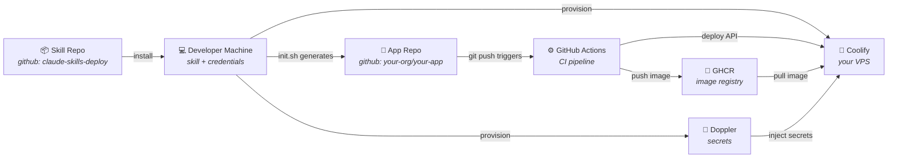
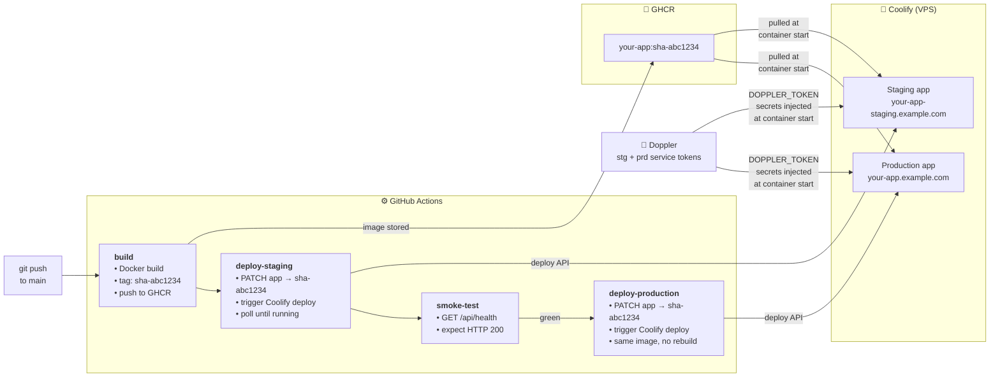

# Architecture & Setup Flow

Two repos and three external services work together to produce a same-image-promotion CI/CD pipeline. This document shows what you build and how the pieces connect.

---

## One-time setup flow

Run through these steps once per domain. Steps ①–③ and ⑤–⑦ are CLI commands; only step ④ (creating the Doppler project) requires a browser.

```mermaid
%%{init: {"flowchart": {"htmlLabels": true}}}%%
flowchart TD
    A["<div style='text-align:left; padding:2px 8px'><b>① Install skill</b><br/>• Fork <code>anatesan-stream/claude-skills-deploy</code> on GitHub<br/>• Clone your fork to <code>~/.claude/skills/setup-coolify/</code></div>"]
    B["<div style='text-align:left; padding:2px 8px'><b>② Configure machine credentials</b><br/>File: <code>~/.claude/coolify.json</code><br/>• Coolify URL<br/>• API key<br/>• ssh_host (alias in ~/.ssh/config)<br/>• Doppler account</div>"]
    C["<div style='text-align:left; padding:2px 8px'><b>③ Bootstrap your app repo</b><br/><code>bash ~/.claude/skills/setup-coolify/init/init.sh</code><br/>Writes two files:<br/>• <code>coolify.yaml</code> — deploy manifest, safe to commit<br/>• <code>.github/workflows/deploy.yml</code> — CI pipeline</div>"]
    D["<div style='text-align:left; padding:2px 8px'><b>④ Create Doppler project</b> ⚠ browser step<br/>• New project at dashboard.doppler.com<br/>• Create two configs: staging · production<br/>• Add all secrets listed in <code>coolify.yaml</code> env_vars</div>"]
    E["<div style='text-align:left; padding:2px 8px'><b>⑤ Dry-run validate</b><br/><code>/setup-coolify validate</code><br/>• Checks Coolify API reachability<br/>• Verifies every Doppler secret exists in staging + production<br/>• No mutations</div>"]
    F["<div style='text-align:left; padding:2px 8px'><b>⑥ Provision</b><br/><code>/setup-coolify</code><br/>• Coolify staging app created<br/>• Coolify production app created<br/>• Doppler service tokens generated + wired as DOPPLER_TOKEN<br/>• Docker volume created on VPS for Doppler fallback cache<br/>• App UUIDs written back to <code>coolify.yaml</code></div>"]
    G["<div style='text-align:left; padding:2px 8px'><b>⑦ Go live</b><br/>• <code>git add coolify.yaml .github/workflows/deploy.yml</code><br/>• <code>git commit -m 'ci: add Coolify deploy pipeline'</code><br/>• <code>git push</code><br/>GitHub Actions pipeline is now active</div>"]

    A --> B --> C --> D --> E --> F --> G

    style A fill:#e3f2fd,stroke:#1976D2,color:#000
    style B fill:#e3f2fd,stroke:#1976D2,color:#000
    style C fill:#e3f2fd,stroke:#1976D2,color:#000
    style D fill:#fff3e0,stroke:#F57C00,color:#000
    style E fill:#e3f2fd,stroke:#1976D2,color:#000
    style F fill:#e3f2fd,stroke:#1976D2,color:#000
    style G fill:#e8f5e9,stroke:#388E3C,color:#000
```

---

## End-state component architecture

Seven components work together once setup is complete. The overview below shows how they connect; the pipeline detail that follows zooms into the runtime deploy loop.

### Overview

**What lives in each component:**

| Component | Contents |
|-----------|----------|
| **Skill Repo** | `SKILL.md`, `scripts/`, `init/`, `docs/`, `references/` — the skill itself, installed once per machine |
| **Developer Machine** | `~/.claude/skills/setup-coolify/` (installed skill) · `~/.claude/coolify.json` (Coolify URL, API key, Doppler account, ssh_host) |
| **App Repo** | `coolify.yaml` (deploy manifest, committed, no secrets) · `.github/workflows/deploy.yml` (CI pipeline, committed) |
| **GitHub Actions** | Build job · deploy-staging job · smoke-test · deploy-production job (see pipeline detail below) |
| **GHCR** | Docker images tagged by git SHA — `your-app:abc1234`, `your-app:def5678`, … |
| **Coolify** | Staging app (`your-app-staging.example.com`) · Production app (`your-app.example.com`) · both with `DOPPLER_TOKEN` env var |
| **Doppler** | One project per app · `stg` config with service token A · `prd` config with service token B |

---

### Runtime pipeline detail

Every `git push` to `main` triggers this sequence. The image is built **once** and the same tag is promoted to production — no rebuild.

---

## What lives where after setup

| Location | Contents | Committed? |
|----------|----------|-----------|
| `~/.claude/skills/setup-coolify/` | Skill files — `SKILL.md`, `scripts/`, `init/`, `docs/` | No — local install |
| `~/.claude/coolify.json` | Coolify URL + API key + Doppler account + `ssh_host` | **Never** — contains secrets |
| `your-app/coolify.yaml` | Deploy manifest: project slug, server alias, domains, env var names | **Yes** — no secrets |
| `your-app/.github/workflows/deploy.yml` | GitHub Actions pipeline (build → GHCR → Coolify) | **Yes** |
| GHCR | Docker images tagged by git SHA; N most recent kept | N/A |
| Coolify (VPS) | Staging app + production app, each with `DOPPLER_TOKEN` env var | N/A |
| Doppler | One project per app; `stg` + `prd` configs with scoped service tokens | N/A |

---

## See also

- [Setup guide](./setup-guide.md) — step-by-step walkthrough with concrete commands
- [Test environment](./test-environment.md) — E2E prerequisites, run/inspect/cleanup workflow
- [Schema reference](./schema.md) — all `coolify.yaml` and `coolify.json` fields documented
- [Fork guide](./fork-guide.md) — using this skill for a second domain (e.g. strategem.ai)
